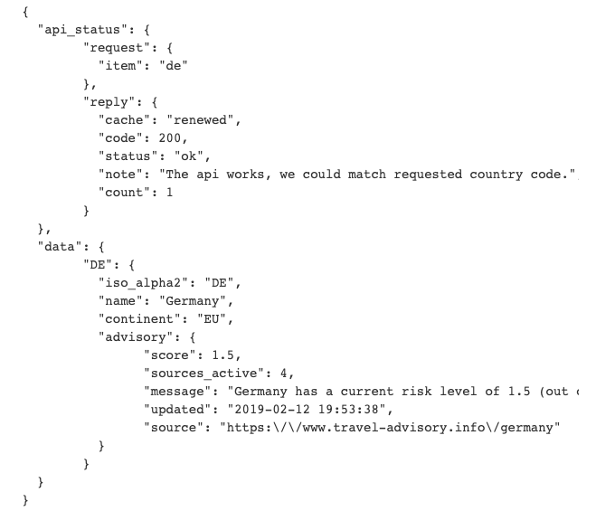
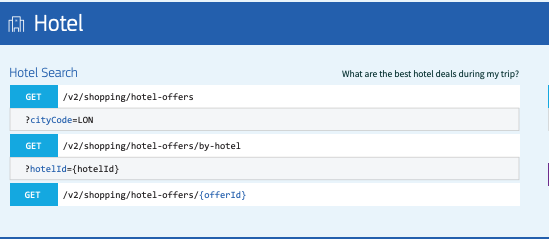

# Travel Safe

Date: November 9, 2020

By: Lisa Venneker Wand

[GitHub](https://github.com/LisaKVW) |
[LinkedIn](https://www.linkedin.com/in/lisa-venneker-wand-8413ab25/) 

## Description
Site to share updated information about safe travel options. 

## Technologies used

## Getting Started
Use this app for more safety information about travel.
Find locations, hotel suggestions, and save your search for reference. 

## User Stories
1. As a user I can search a country or city and find information about travel safeness.
2. As a user I can find hotel recommendations in country/city of choice
3. As a user I can read about hotel details e.g. restaurants, attractions, ratings and saftey.
4. As a user I can save my search
5. As a user I can post travel advise.
6. As a user I can post tips/comments on hotels.

## Wireframe

## Screenshots
To follow ones app is done.

## Code snippet
Code Snippet of API

## Trello link
https://trello.com/b/lsbkPZfo/travel-safe-p2 

## Credits
- Data on locations and accomodation from: API https://developers.amadeus.com/
- Data on Covid-19: https://www.travel-advisory.info/ 
